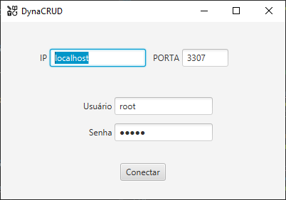
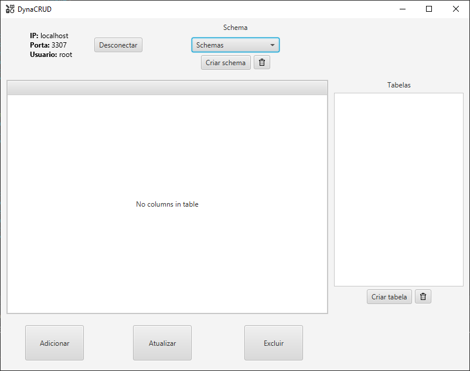
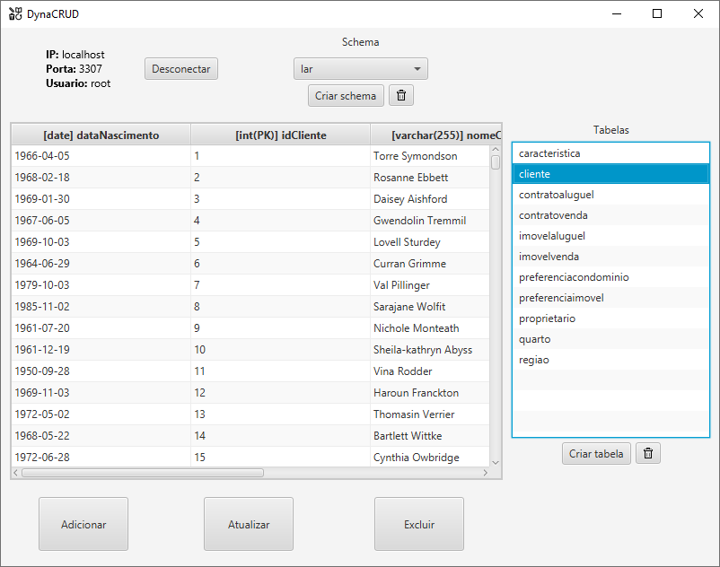
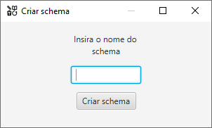
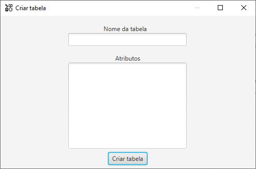
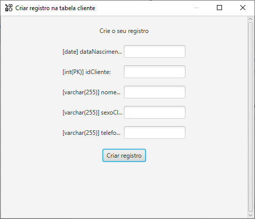
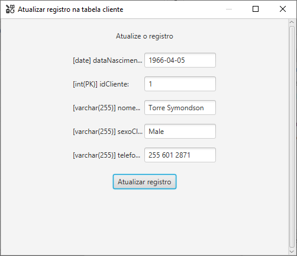

# DynaCRUD

## Descrição
Este projeto é um aplicativo CRUD dinâmico desenvolvido em Java usando Maven e JavaFX. Ele permite realizar operações de **Create (Criar)**, **Read (Ler)**, **Update (Atualizar)** e **Delete (Excluir)** em um banco de dados relacional, com uma interface gráfica moderna e responsiva.

### Tela de conexão
[]

### Tela principal
[]
[]

### Telas criar schema e tabela
[]
[]

### Telas criar e atualizar registro
[]
[]

## Recursos
- Interface gráfica intuitiva e fácil de usar.
- Conexão com banco de dados relacional.
- Configuração simplificada usando Maven.
- Estrutura de projeto organizada seguindo o padrão MVC.
- Suporte a múltiplas tabelas e esquemas de banco de dados.
- Validação de dados e mensagens de erro claras.

## Tecnologias Utilizadas
- **Linguagem de Programação:** Java
- **Framework de Interface Gráfica:** JavaFX
- **Gerenciador de Dependências:** Maven
- **Banco de Dados:** MySQL

## Configuração
### Pré-requisitos
- Java 19+
- Maven 3.9.6+
- Banco de dados instalado e configurado

### Passos para Configuração
1. Clone o repositório:
   ```bash
   git clone https://github.com/CoracaoDeLeao/DynaCRUD.git
   ```
2. Navegue até o diretório do projeto:
   ```bash
   cd DynaCRUD
   ```
3. Compile o projeto:
   ```bash
   mvn clean install
   ```
4. Execute o aplicativo:
   ```bash
   mvn javafx:run
   ```

## Contribuindo
Contribuições são bem-vindas! Siga os passos abaixo para contribuir:
1. Fork o repositório.
2. Crie um branch para sua feature (`git checkout -b feature/nova-feature`).
3. Commit suas mudanças (`git commit -m 'Adiciona nova feature'`).
4. Faça push para seu branch (`git push origin feature/nova-feature`).
5. Abra um Pull Request.

---

✨ Desenvolvido por [Isaac](https://github.com/CoracaoDeLeao).